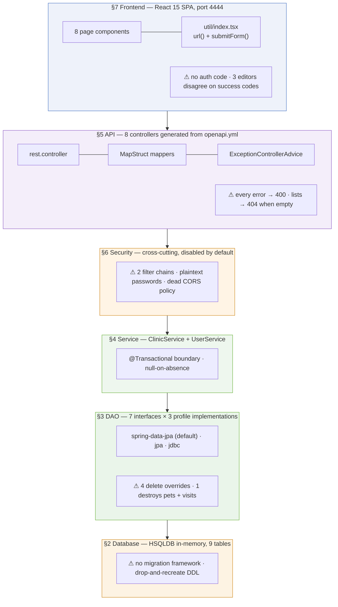
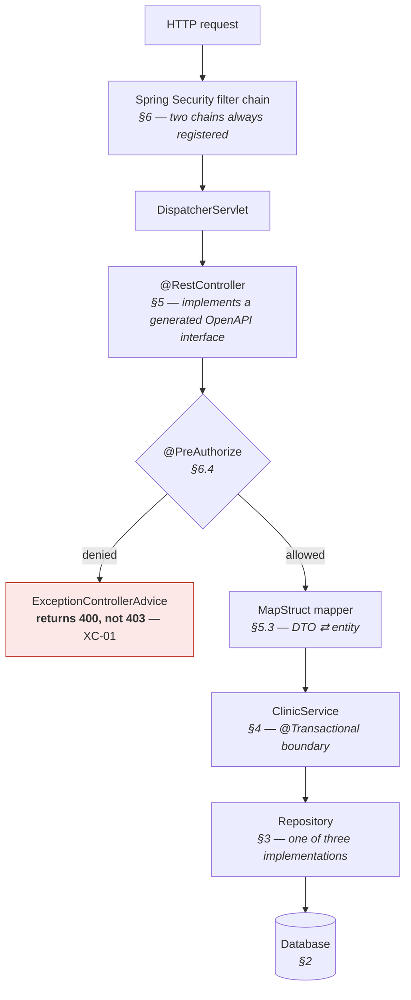
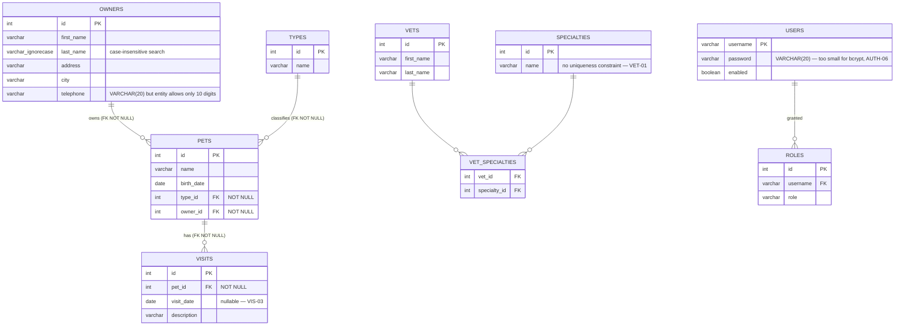
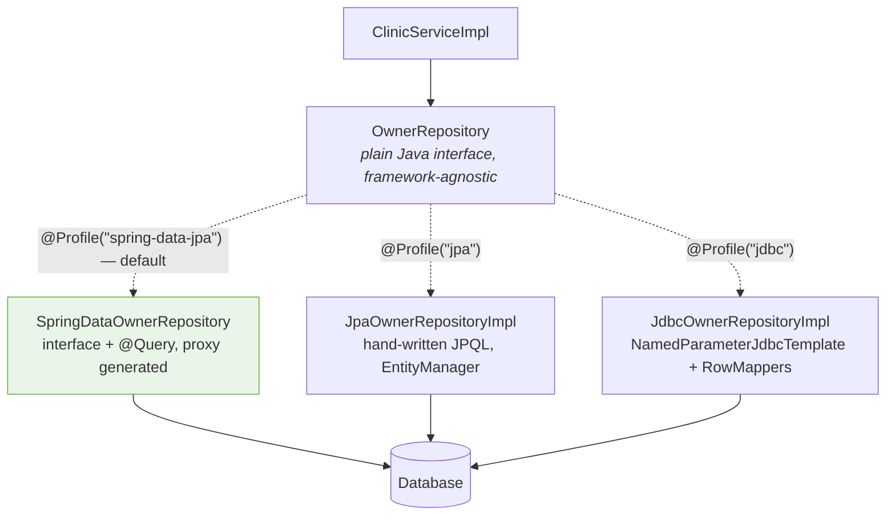
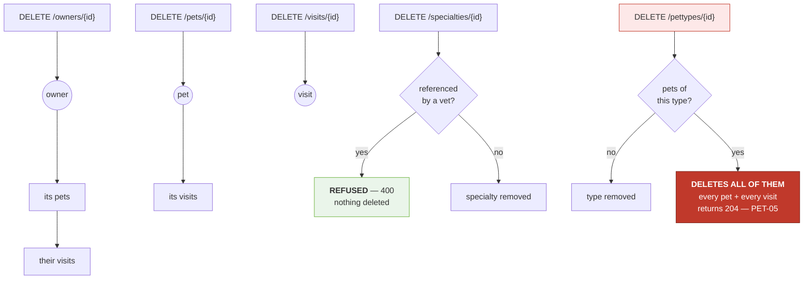
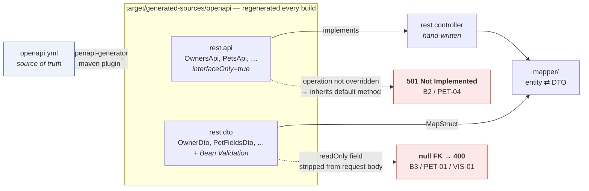
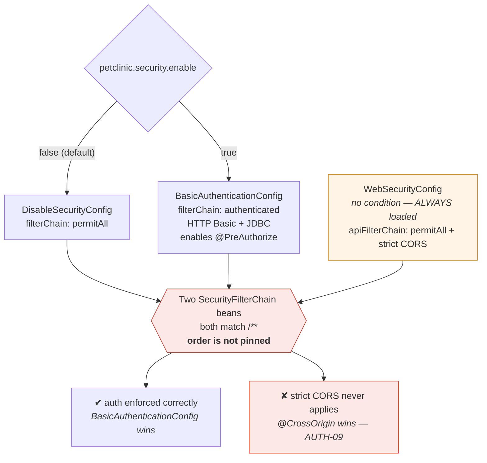
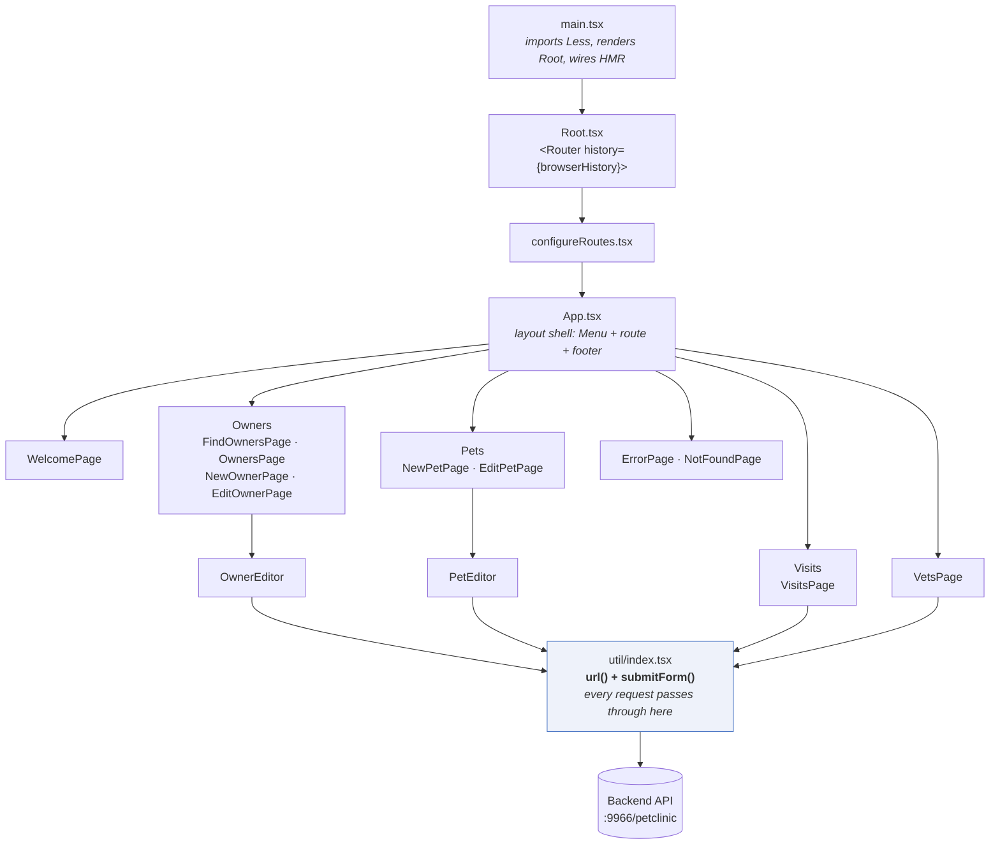

# Architecture

A layer-by-layer description of this repository as it actually exists: the database, the DAO
layer, the service layer, the REST controllers, the authentication and authorization process,
and the React frontend.

- **Date:** 2026-09-16
- **Last reviewed:** 2026-09-16

Everything here was verified against a running instance. Where behaviour differs from what the
code appears to promise, that is called out inline and cross-referenced to the gap IDs in the
documents below.

### The baseline document set

This is the **system-wide** view. Per-slice detail, gap catalogues and remediation phases live
in the PRDs.

| Document | Covers | Gap IDs |
|---|---|---|
| **ARCHITECTURE.md** *(this file)* | layer-by-layer view of the whole system | — |
| [BASELINE_UPDATES_FOR_MODERNIZATION.md](./BASELINE_UPDATES_FOR_MODERNIZATION.md) | work log: what was changed to make it run, and every defect found | `B1`–`B12`, `F1`–`F4` |
| [AUTHENTICATION_BASELINE_PRD.md](./AUTHENTICATION_BASELINE_PRD.md) | users, roles, security config, authorization | `AUTH-01`–`AUTH-14` |
| [OWNERS_BASELINE_PRD.md](./OWNERS_BASELINE_PRD.md) | owners, the domain aggregate root | `OWN-01`–`OWN-13` |
| [PETS_BASELINE_PRD.md](./PETS_BASELINE_PRD.md) | pets and pet types | `PET-01`–`PET-12` |
| [VISITS_BASELINE_PRD.md](./VISITS_BASELINE_PRD.md) | visits | `VIS-01`–`VIS-08` |
| [VETS_BASELINE_PRD.md](./VETS_BASELINE_PRD.md) | vets and specialties | `VET-01`–`VET-09` |
| [CROSS_CUTTING_BASELINE_PRD.md](./CROSS_CUTTING_BASELINE_PRD.md) | concerns spanning every slice | `XC-01`–`XC-09` |

> **Most urgent finding across the whole set:** `DELETE /api/pettypes/{id}` deletes every pet of
> that type and all their visits, returning `204` (§3.4, `PET-05` / `XC-07`).

### The system at a glance

Where each layer lives, and where the known problems cluster:



---

## 1. Topology

Two independently deployed processes:

```mermaid
flowchart LR
    B["🌐 Browser"]

    subgraph FE ["Frontend process — port 4444"]
        WDS["webpack-dev-server 5<br/>serves bundle.js + static assets"]
        SPA["React 15 SPA<br/>__API_SERVER_URL__ compiled in"]
    end

    subgraph BE ["Backend process — port 9966, context /petclinic"]
        SEC["Spring Security filter chain"]
        MVC["DispatcherServlet<br/>8 @RestControllers"]
        SVC["ClinicService / UserService"]
        REPO["Repositories<br/>1 of 3 profiles active"]
    end

    DB[("HSQLDB in-memory<br/>reseeded on every start")]

    B --> WDS --> SPA
    SPA -- "cross-origin fetch<br/>(no proxy)" --> SEC
    SEC --> MVC --> SVC --> REPO --> DB

    style BE fill:#eef7ee,stroke:#6db33f
    style FE fill:#eef2fa,stroke:#4a76c4
    style DB fill:#fff4e5,stroke:#d08a20
```



The frontend does **not** proxy API calls. The backend URL is compiled into the bundle by
webpack's `DefinePlugin` as `__API_SERVER_URL__`, so every call is genuinely cross-origin and
depends on CORS (§6.6).

### Request path through the backend



Note the branch on the left: **every** failure anywhere below this point is funnelled through
the same advice and emerges as a `400` (§5.4).

---

## 2. Database layer

### 2.1 Engine options

Selected by Spring profile in `src/main/resources/application.properties`:

```properties
spring.profiles.active=hsqldb,spring-data-jpa
```

| Profile | Property file | Notes |
|---|---|---|
| `hsqldb` *(default)* | `application-hsqldb.properties` | `jdbc:hsqldb:mem:petclinic`, user `sa`, no password |
| `mysql` | `application-mysql.properties` | `localhost:3306/petclinic`, user `pc` |
| `postgresql` | `application-postgresql.properties` | |

Schema and seed DDL live under `src/main/resources/db/{hsqldb,mysql,postgresql}/`. Hibernate
does **not** manage the schema — `spring.jpa.hibernate.ddl-auto=none` throughout. Tables are
created by `spring.sql.init.schema-locations` running `initDB.sql`, then populated by
`populateDB.sql`. With the in-memory default this happens on **every startup**, so all data is
lost on restart and any test mutation is undone by bouncing the process.

### 2.2 Schema evolution — there is no migration framework

**Neither Flyway nor Liquibase is present.** Verified against both `pom.xml` and the built
artefact: none of the 90 jars bundled in `target/spring-petclinic-rest-3.2.1.jar` is a migration
library, and there is no `db/migration` directory or changelog file anywhere in the tree.

Whether the init scripts run at all differs by database:

| Database | `spring.sql.init.*` | Effect |
|---|---|---|
| HSQLDB | active | schema and seed applied on every startup |
| MySQL | **commented out** | must be applied manually on first start |
| PostgreSQL | **commented out** | must be applied manually on first start |

In `application-mysql.properties` and `application-postgresql.properties` the init lines sit
commented out under `# uncomment for init database (first start)`, and each dialect ships a
`petclinic_db_setup_*.txt` with manual instructions. Schema management for the persistent
databases is a documented manual procedure, not an automated one.

The scripts are **create-from-scratch, not incremental**. `initDB.sql` opens with
`DROP TABLE ... IF EXISTS` for all nine tables and recreates them. There is no version table, no
ordering, and no up/down concept, so nothing can evolve a database that already holds data.

This asymmetry matters before changing any table. Under the in-memory default a schema edit
always *appears* to work, because the database is rebuilt from the script on every start. A
persistent MySQL or PostgreSQL instance never re-runs that script and silently keeps the old
schema, with no error to signal the difference.

Two already-known defects require schema changes: `users.password` is `VARCHAR(20)` and cannot
hold a 60-character bcrypt hash, and the `roles` uniqueness constraint declared on the entity is
never created because `ddl-auto=none` (§2.5). Both would currently have to be applied by hand to
three dialects, with no record of which environment received them. Tracked as `AUTH-14` in
[AUTHENTICATION_BASELINE_PRD.md](./AUTHENTICATION_BASELINE_PRD.md), where adopting a migration
tool is a prerequisite for that slice's remediation.

### 2.3 Schema

Nine tables — seven domain, two identity. From `db/hsqldb/initDB.sql`:



There is **no relationship between `vets` and `visits`** — the system records that a visit
happened but never who performed it.

| Table | Columns | Notes |
|---|---|---|
| `owners` | `id`, `first_name`, `last_name`, `address`, `city`, `telephone` | `last_name` is `VARCHAR_IGNORECASE` — case-insensitive search |
| `pets` | `id`, `name`, `birth_date`, `type_id` → `types`, `owner_id` → `owners` | both FKs `NOT NULL` |
| `types` | `id`, `name` | pet types (cat, dog, …) |
| `visits` | `id`, `pet_id` → `pets`, `visit_date`, `description` | |
| `vets` | `id`, `first_name`, `last_name` | |
| `specialties` | `id`, `name` | |
| `vet_specialties` | `vet_id` → `vets`, `specialty_id` → `specialties` | join table, no surrogate key |
| `users` | `username` (PK), `password`, `enabled` | see §6.5 |
| `roles` | `id`, `username` → `users`, `role` | |

All surrogate keys are `INTEGER IDENTITY`. Indexes exist on the lookup columns
(`owners.last_name`, `pets.name`, `vets.last_name`, `specialties.name`, `types.name`,
`visits.pet_id`, `roles.username`).

The `NOT NULL` constraints on `pets.owner_id` and `visits.pet_id` are what turn defect **B3**
into a 400: the generated DTOs drop the incoming id, and the insert violates the constraint.

### 2.4 Seed data

`db/hsqldb/populateDB.sql` inserts 10 owners, 13 pets, 6 pet types, 4 visits, 6 vets,
3 specialties, 5 vet-specialty links, 1 user and 3 roles.

### 2.5 Entity model

JPA entities in `model/`, using a shallow inheritance chain of mapped superclasses:

```
BaseEntity   (@MappedSuperclass)  id : Integer, @GeneratedValue(IDENTITY), isNew()
  ├── NamedEntity                 name : String @NotEmpty
  │     ├── Pet                   birthDate, @ManyToOne type, @ManyToOne owner, @OneToMany visits
  │     ├── PetType
  │     └── Specialty
  ├── Person                      firstName, lastName (both @NotEmpty)
  │     ├── Owner                 address, city, telephone, @OneToMany pets
  │     └── Vet                   @ManyToMany specialties
  ├── Visit                       date, description, @ManyToOne pet
  └── Role                        name, @ManyToOne user

User  (not a BaseEntity)          username as @Id, password, enabled, @OneToMany roles
```

Three characteristics matter downstream:

**Everything is `FetchType.EAGER`.** `Owner.pets`, `Pet.visits`, `Vet.specialties` and
`User.roles` all load eagerly. Combined with `spring.jpa.open-in-view=false`, this is what makes
the API work without lazy-initialisation errors, at the cost of always fetching full object
graphs.

**`BaseEntity` does not override `equals()` or `hashCode()`.** Entity comparison is therefore
reference identity. This is the direct cause of defect **B1**: `OwnerRestController.getOwnersPet`
compares a pet's owner to a separately-loaded owner, and since the two lookups occur in
different persistence contexts the instances are never identical.

**Some entity-declared constraints never reach the database.** `Role` declares
`@Table(name = "roles", uniqueConstraints = @UniqueConstraint(columnNames = {"username", "role"}))`,
but because `ddl-auto=none` the schema comes solely from `initDB.sql`, which does not create it.
Duplicate role rows are therefore possible. This is the general hazard of hand-written DDL with
Hibernate disabled: an annotation can look authoritative while having no effect (§2.2).

Collections are exposed defensively — `Owner.getPets()` and `Vet.getSpecialties()` return sorted
`Collections.unmodifiableList` views over the internal `Set`.

---

## 3. DAO / repository layer

### 3.1 Interface contract

`repository/` defines seven plain Java interfaces — `OwnerRepository`, `PetRepository`,
`PetTypeRepository`, `SpecialtyRepository`, `VetRepository`, `VisitRepository`,
`UserRepository`. They are hand-written and framework-agnostic:

```java
public interface OwnerRepository {
    Collection<Owner> findByLastName(String lastName) throws DataAccessException;
    Owner findById(int id) throws DataAccessException;
    void save(Owner owner) throws DataAccessException;
    Collection<Owner> findAll() throws DataAccessException;
    void delete(Owner owner) throws DataAccessException;
}
```

### 3.2 Three interchangeable implementations

This is the most distinctive thing about the codebase: each interface has **three**
implementations, selected by Spring profile. Nothing above this layer changes when you switch.

| Package | Profile | Technique |
|---|---|---|
| `repository/jpa/` | `jpa` | Hand-written JPQL via an injected `EntityManager` |
| `repository/jdbc/` | `jdbc` | `NamedParameterJdbcTemplate` with explicit `RowMapper`s |
| `repository/springdatajpa/` | `spring-data-jpa` *(default)* | Spring Data derived/annotated queries |

Every implementation class carries `@Repository` and `@Profile("...")`, so exactly one set is
active. Switching is a one-word edit to `spring.profiles.active`.



**Adding one method to the interface means writing three implementations.** Miss one and that
profile breaks — at startup for Spring Data, at call time for the others.

The **jdbc** flavour carries extra machinery the other two do not need, because it has to
reassemble object graphs by hand: `JdbcPet` (a `Pet` subclass holding raw `type_id`/`owner_id`),
`JdbcPetRowMapper`, `JdbcVisitRowMapper` and `JdbcPetVisitExtractor`.

### 3.3 The Spring Data override pattern

Under `spring-data-jpa` the repositories are interfaces with no implementation class — Spring
Data generates the proxy:

```java
@Profile("spring-data-jpa")
public interface SpringDataOwnerRepository extends OwnerRepository, Repository<Owner, Integer> {

    @Override
    @Query("SELECT DISTINCT owner FROM Owner owner left join fetch owner.pets WHERE owner.lastName LIKE :lastName%")
    Collection<Owner> findByLastName(@Param("lastName") String lastName);

    @Override
    @Query("SELECT owner FROM Owner owner left join fetch owner.pets WHERE owner.id =:id")
    Owner findById(@Param("id") int id);
}
```

Note `left join fetch` — the eager graph is assembled in one query rather than N+1.

Also note `findByLastName` uses `LIKE :lastName%`, so owner search is a **prefix match**, not an
exact one, and it is case-insensitive because of the `VARCHAR_IGNORECASE` column type.

### 3.4 The delete overrides — where the dangerous behaviour lives

Where behaviour cannot be derived from a method name or expressed as a single query, the project
uses a companion `...RepositoryOverride` interface plus a hand-written `...RepositoryImpl` class,
which Spring Data mixes into the generated proxy. There are exactly four, and **all four exist
solely to override `delete`**. Their semantics are inconsistent and worth knowing before calling
any delete endpoint:

| Class | What `delete` does | Effect |
|---|---|---|
| `SpringDataVisitRepositoryImpl` | deletes the visit row | expected |
| `SpringDataPetRepositoryImpl` | deletes the pet's visits, then the pet | expected cascade |
| `SpringDataSpecialtyRepositoryImpl` | tries to clear `vet_specialties`, then delete the specialty | **refuses** when in use — see below |
| `SpringDataPetTypeRepositoryImpl` | deletes every pet of that type, **each pet's visits**, then the type | **destructive** |

What each `DELETE` endpoint actually destroys:



The two lookup tables are structurally identical and behave in **opposite** ways. Verified:
`DELETE /api/pettypes/1` (cat) returned `204` and took the pet count from 13 to 9.

Two findings here matter more than the pattern itself.

**Deleting a pet type destroys pets and visits.** `SpringDataPetTypeRepositoryImpl.delete`
explicitly removes dependent records rather than refusing:

```java
List<Pet> pets = this.em.createQuery("SELECT pet FROM Pet pet WHERE type.id=" + petTypeId).getResultList();
for (Pet pet : pets) {
    for (Visit visit : pet.getVisits()) {
        this.em.createQuery("DELETE FROM Visit visit WHERE id=" + visit.getId()).executeUpdate();
    }
    this.em.createQuery("DELETE FROM Pet pet WHERE id=" + pet.getId()).executeUpdate();
}
```

Verified: `DELETE /api/pettypes/1` (cat) returned **204** and reduced the pet count from 13 to 9,
leaving owner 1 with `"pets": []`. Nothing in the response indicates the collateral damage. This
is the single most dangerous defect in the codebase, tracked as `PET-05` / `XC-07`.

**Specialty deletion behaves the opposite way, and only by accident.** `em.remove` is queued
before the join-table cleanup, so the flush attempts the specialty delete first and the foreign
key rejects it — the caller gets a 400 and nothing is deleted. Refusing is the *safe* outcome,
but it is a consequence of flush ordering rather than an explicit check, so a refactor could
silently turn it into the pet-type behaviour.

**All four classes build their queries by string concatenation** rather than bound parameters,
including one `createNativeQuery`. The concatenated values are `Integer` path variables today,
so they are type-constrained and not currently exploitable, but the pattern is unsafe and should
not be copied (`XC-06`).

---

## 4. Service layer

Two services in `service/`.

### 4.1 `ClinicService` / `ClinicServiceImpl`

A single flat facade over all six domain repositories, injected by constructor. Its own comment
describes it as *"mostly a facade for all Petclinic controllers, also a placeholder for
`@Transactional` and `@Cacheable` annotations."*

It holds essentially no business logic. Its real job is to be the **transaction boundary**:
reads are `@Transactional(readOnly = true)`, writes are `@Transactional`. Most methods are
one-line delegations.

The one consistent behaviour it does add is **converting "not found" into `null`**:

```java
@Override
@Transactional(readOnly = true)
public Owner findOwnerById(int id) throws DataAccessException {
    Owner owner = null;
    try {
        owner = ownerRepository.findById(id);
    } catch (ObjectRetrievalFailureException | EmptyResultDataAccessException e) {
        // just ignore not found exceptions for Jdbc/Jpa realization
        return null;
    }
    return owner;
}
```

This exists because the three DAO implementations signal absence differently — Spring Data
returns `null` while the JPA and JDBC versions throw. Swallowing the exception here is what lets
controllers uniformly write `if (x == null) return 404`.

Because each service call opens and closes its own transaction, two consecutive calls return
entities from **different persistence contexts**. That is the mechanism behind defect **B1**.

### 4.2 `UserService` / `UserServiceImpl`

Handles user creation only. It rejects a user with no roles, then normalises role names by
prefixing `ROLE_` if absent:

```java
for (Role role : user.getRoles()) {
    if (!role.getName().startsWith("ROLE_")) {
        role.setName("ROLE_" + role.getName());
    }
    if (role.getUser() == null) {
        role.setUser(user);
    }
}
userRepository.save(user);
```

This is why posting `{"name":"VET_ADMIN"}` comes back as `ROLE_VET_ADMIN`. Note there is **no
password encoding** anywhere in this method — see §6.5 and defect **B6**.

---

## 5. API / controller layer

### 5.1 Contract-first generation

`src/main/resources/openapi.yml` is the source of truth. At build time the
`openapi-generator-maven-plugin` generates, into `target/generated-sources/openapi`:

- **API interfaces** in `rest.api` (`OwnersApi`, `PetsApi`, …) — `interfaceOnly=true`, so only
  the interface with its Spring MVC annotations is produced;
- **DTOs** in `rest.dto` with a `Dto` suffix, with Bean Validation annotations
  (`performBeanValidation=true`) and `java8` dates.

`build-helper-maven-plugin` adds that directory as a source root. **Never edit generated
sources** — change the spec and rebuild.



The two red boxes are defects that arise **directly** from this generation model: a controller
that fails to implement a new operation still compiles and silently returns 501 (defect **B2**),
and a `readOnly` field is accepted then discarded before it reaches the entity (**B3**).

### 5.2 Controllers

Eight controllers in `rest/controller/`, each thin:

| Controller | Implements | Base path |
|---|---|---|
| `OwnerRestController` | `OwnersApi` | `/api` |
| `PetRestController` | `PetsApi` | `/api` |
| `PetTypeRestController` | `PettypesApi` | `/api` |
| `VisitRestController` | `VisitsApi` | `/api` |
| `VetRestController` | `VetsApi` | `/api` |
| `SpecialtyRestController` | `SpecialtiesApi` | `/api` |
| `UserRestController` | `UsersApi` | `/api` |
| `RootRestController` | — | `/` |

All are annotated `@CrossOrigin(exposedHeaders = "errors, content-type")` — which, as §6.6
explains, is what actually governs CORS. With the `/petclinic/` context path, the effective base
is `http://localhost:9966/petclinic/api`.

A typical handler maps the DTO, calls the service, and translates the result to a status code:

```java
@PreAuthorize("hasRole(@roles.OWNER_ADMIN)")
@Override
public ResponseEntity<OwnerDto> getOwner(Integer ownerId) {
    Owner owner = this.clinicService.findOwnerById(ownerId);
    if (owner == null) {
        return new ResponseEntity<>(HttpStatus.NOT_FOUND);
    }
    return new ResponseEntity<>(ownerMapper.toOwnerDto(owner), HttpStatus.OK);
}
```

Status conventions: create → `201` with a `Location` header, update → `204`, delete → `204`,
missing → `404`. Two deviations are worth knowing:

- **List endpoints return `404` rather than an empty array** when nothing matches. The
  `isEmpty()` → `NOT_FOUND` guard is present in all six list controllers, so this is a
  system-wide convention rather than an oversight in one place (`XC-02`).
- **`POST /pets` breaks the create convention**, returning `200` with no `Location` header and
  echoing back the request DTO rather than the persisted entity (`PET-08`). It is unreachable
  in practice — `ownerId` is stripped as `readOnly`, so the insert always violates a not-null
  foreign key (`PET-01`).

The `204` on update, and the `201` on create, are both mishandled by the frontend — see §7.3.

### 5.3 Mapping

MapStruct interfaces in `mapper/` convert between entities and DTOs, configured in the POM with
`defaultComponentModel=spring` so the generated mappers are injectable beans. Most mappings are
implicit; explicit ones handle flattening:

```java
@Mapper
public interface PetMapper {
    @Mapping(source = "owner.id", target = "ownerId")
    PetDto toPetDto(Pet pet);
    ...
}
```

The mapping direction is asymmetric by design. `ownerId` and `petId` are `readOnly` in the
OpenAPI schema, so they are populated on the way **out** but ignored on the way **in** — the
mechanism behind defect **B3**.

Two DTO shapes exist per aggregate: `XFields` (editable fields, used for request bodies) and `X`
(the full resource with server-assigned ids and nested collections).

### 5.4 Error handling

`rest/advice/ExceptionControllerAdvice` has a single catch-all:

```java
@ExceptionHandler(Exception.class)
public ResponseEntity<String> exception(Exception e) {
    ...
    return ResponseEntity.badRequest().body(respJSONstring);   // always 400
}
```

Every unhandled exception becomes a **400** carrying `{"className": ..., "exMessage": ...}`.
This is defect **B5** / `XC-01`, and it is the single biggest source of misleading status codes
in the API. Verified consequences, each observed in a different slice:

| Actual condition | Correct status | Returned |
|---|---|---|
| Caller lacks the required role | 403 | **400** |
| Route matches no controller | 404 | **400** |
| Foreign-key violation (in-use specialty) | 409 | **400** |
| Entity validation failure at persist (owner telephone) | 400/422 | 400, with a raw exception dump |

The body leaks the framework, persistence layer, table names and constraint names to any
caller. A second handler converts Bean Validation failures into a 400 with structured detail in
an `errors` header — this path is correct and must be preserved (which is why the controllers
export that header via `@CrossOrigin`).

> A `400` from this API therefore says almost nothing about the request. Read the `className`
> field before assuming the caller is at fault.

### 5.5 Supporting configuration

`config/SwaggerConfig` builds the springdoc `OpenAPI` bean; Swagger UI is served at
`/petclinic/swagger-ui.html`. Actuator is on the classpath with default settings
(`/petclinic/actuator/health`). `util/CallMonitoringAspect` implements JMX call timing around
`@Repository` beans but is **never registered as a bean**, so it does not run. The
`spring-boot-starter-cache` dependency is present but unused, as are
`ClinicService.findVisitsByPetId` (no endpoint calls it) and the duplicate
`findVets()` / `findAllVets()` pair (`XC-09`).

---

## 6. Authentication and authorization

The most consequential part of the configuration, and the part where intent and behaviour
diverge most.

### 6.1 The switch

```properties
petclinic.security.enable=false
```

Default is **disabled**, so out of the box every endpoint is public.

### 6.2 Three security configurations

| Class | Condition | Provides |
|---|---|---|
| `WebSecurityConfig` | **none — always active** | `apiFilterChain`: permit all + a restrictive CORS policy |
| `DisableSecurityConfig` | `petclinic.security.enable=false` | `filterChain`: permit all, CSRF off |
| `BasicAuthenticationConfig` | `petclinic.security.enable=true` | `filterChain`: authenticate everything via HTTP Basic + JDBC, enables `@PreAuthorize` |

`WebSecurityConfig` is unconditional, so **two `SecurityFilterChain` beans always exist**, both
matching `/**`.



That is fragile — the effective policy depends on bean ordering rather than on anything
explicit. Verified: authentication *is* correctly enforced when enabled (§6.7), so
`BasicAuthenticationConfig` wins; but `WebSecurityConfig`'s CORS policy never applies (§6.6).
Anyone changing these classes should re-test **both**, because nothing in the code pins the
ordering.

### 6.3 Authentication mechanism

When enabled, `BasicAuthenticationConfig` uses **HTTP Basic** over JDBC authentication against
the existing tables:

```java
auth.jdbcAuthentication()
    .dataSource(dataSource)
    .usersByUsernameQuery("select username,password,enabled from users where username=?")
    .authoritiesByUsernameQuery("select username,role from roles where username=?");
```

There are no sessions, tokens or JWTs — credentials are sent on every request. CSRF is disabled
in all configurations, which is consistent with a stateless API.

### 6.4 Authorization model

`@EnableGlobalMethodSecurity(prePostEnabled = true)` activates the `@PreAuthorize` annotations
already present on every controller method. Roles are constants on a `Roles` bean, referenced
through SpEL:

```java
@Component
public class Roles {
    public final String OWNER_ADMIN = "ROLE_OWNER_ADMIN";
    public final String VET_ADMIN   = "ROLE_VET_ADMIN";
    public final String ADMIN       = "ROLE_ADMIN";
}
```

```java
@PreAuthorize("hasRole(@roles.OWNER_ADMIN)")
```

| Role | Grants |
|---|---|
| `ROLE_OWNER_ADMIN` | owners, pets, pet types, visits |
| `ROLE_VET_ADMIN` | vets, specialties |
| `ROLE_ADMIN` | user management (`POST /users`) |

Because the annotations are always present and only *activated* by the enabled configuration,
turning security on changes authorization behaviour across the whole API at once.

### 6.5 Credential storage

The seeded user is **`admin` / `admin`**, with all three roles:

```sql
INSERT INTO users(username,password,enabled) VALUES ('admin','{noop}admin', true);
INSERT INTO roles (username, role) VALUES ('admin', 'ROLE_OWNER_ADMIN');
INSERT INTO roles (username, role) VALUES ('admin', 'ROLE_VET_ADMIN');
INSERT INTO roles (username, role) VALUES ('admin', 'ROLE_ADMIN');
```

`{noop}` is Spring Security's `DelegatingPasswordEncoder` prefix meaning *no encoding* — the
password is plaintext.

Three consequences worth understanding before enabling auth in any real setting:

1. **Nothing hashes passwords.** `UserServiceImpl.saveUser` persists whatever it is given.
2. **A password created through the API is unusable for login unless it carries an encoder
   prefix.** `DelegatingPasswordEncoder` cannot identify a bare string and rejects it. Creating
   a working user via `POST /users` requires literally sending `"password": "{noop}secret"`.
3. **`users.password` is `VARCHAR(20)`** — too narrow for a 60-character bcrypt hash, so fixing
   this properly requires a schema change.

`POST /users` also echoes the submitted password back in its response body. Together these are
defect **B6**.

### 6.6 CORS — intent versus reality

Two mechanisms are configured, and the stricter one loses.

`WebSecurityConfig` intends to restrict access:

```java
configuration.setAllowedOrigins(List.of("http://localhost:4444"));
configuration.setAllowedMethods(List.of("OPTIONS", "GET", "POST", "PUT"));
```

Every controller separately declares `@CrossOrigin(exposedHeaders = "errors, content-type")`,
which defaults to **all origins and all methods**. The annotation is what actually takes effect:

| Probe | Result |
|---|---|
| `GET` with `Origin: http://localhost:4444` | `Access-Control-Allow-Origin: *` |
| Preflight `POST` from `localhost:4444` | allowed, `Max-Age: 1800` |
| Preflight `DELETE` (not in the allow-list) | **allowed** |
| Preflight from `http://evil.com` | **allowed**, `Access-Control-Allow-Origin: *` |

So the API is open to any origin. This is defect **B7**. It is also why the frontend on port
4444 works at all, and why the unmatched `/api/oops` route (**B4**) surfaces in the browser as a
CORS error: no handler matches, so `@CrossOrigin` never applies and the error response carries
no CORS headers.

### 6.7 Verified behaviour

Measured against a second instance started with `--petclinic.security.enable=true`:

| Request | Status |
|---|---|
| `GET /vets` — no credentials | `401` |
| `GET /vets` — wrong password | `401` |
| `GET /vets` — `admin:admin` | `200` |
| `POST /users` — `admin` creating a `VET_ADMIN`-only user | `201` |
| `GET /vets` — as that user (has the role) | `200` |
| `GET /owners` — as that user (lacks `OWNER_ADMIN`) | `400` ⚠ |
| `POST /users` — as that user (lacks `ADMIN`) | `400` ⚠ |

Authentication and role enforcement both work correctly. The flaw is the status code:
authorization failures should be `403`, but the catch-all advice (§5.4) converts
`AccessDeniedException` into `400` and returns its fully-qualified class name to the caller.

---

## 7. Frontend

### 7.1 Stack

React 15 with TypeScript, React Router 2, Bootstrap 3 via Less, and `whatwg-fetch`. Built by
webpack 5 with `ts-loader` in `transpileOnly` mode. Type checking is off because the React 15
type definitions came from the retired `typings` registry.

### 7.2 Composition



`util/index.tsx` is the single choke point for all server communication — the natural place to
add credentials (§6) or fix status-code handling (§7.3).

Routes, in `configureRoutes.tsx`:

| Path | Component |
|---|---|
| `/` | `WelcomePage` |
| `/owners/list` | `FindOwnersPage` |
| `/owners/new` | `NewOwnerPage` |
| `/owners/:ownerId` | `OwnersPage` (detail) |
| `/owners/:ownerId/edit` | `EditOwnerPage` |
| `/owners/:ownerId/pets/new` | `NewPetPage` |
| `/owners/:ownerId/pets/:petId/edit` | `EditPetPage` |
| `/owners/:ownerId/pets/:petId/visits/new` | `VisitsPage` |
| `/vets` | `VetsPage` |
| `/error` | `ErrorPage` |
| `*` | `NotFoundPage` |

Because these are real paths rather than hashes, the dev server needs
`historyApiFallback: true`, which the migrated webpack config sets.

Components are grouped by feature under `src/components/` (`owners/`, `pets/`, `visits/`,
`vets/`, `form/`). There is **no state container** — no Redux, no context. Each page component
fetches into its own `this.state` in `componentDidMount`. Editor components (`OwnerEditor`,
`PetEditor`) hold a working copy of the entity and validate per field on change.

The `form/` directory holds the reusable input primitives: `Input`, `DateInput`
(react-datepicker), `SelectInput`, `FieldFeedbackPanel` for the validation tick/error, and
`Constraints.ts` with `NotEmpty` and `Digits(n)`.

### 7.3 Server communication

All of it goes through `src/util/index.tsx`:

```ts
declare var __API_SERVER_URL__;
const BACKEND_URL = (typeof __API_SERVER_URL__ === 'undefined' ? 'http://localhost:9966/petclinic' : __API_SERVER_URL__);

export const url = (path: string): string => `${BACKEND_URL}/${path.replace(/^\/+/, '')}`;

export const submitForm = (method, path, data, onSuccess) => { ... };
```

`url()` builds absolute URLs against the compiled-in backend; `submitForm` wraps `fetch` for
writes and invokes `onSuccess(status, body)`, treating `204` as an empty body. Reads call
`fetch` directly.

`submitForm` deliberately passes the **status code** rather than throwing, leaving each caller to
decide what counts as success. **All three editors get that decision wrong, in two different
directions**, because no convention is documented anywhere:

| Component | Accepts as success | Endpoint actually returns | Result |
|---|---|---|---|
| `OwnerEditor` | `200`/`201` | `204` on update | page crashes after a successful save (`F1`, `OWN-04`) |
| `VisitsPage` | `204` | `201` on create | error shown though the visit was saved; retries duplicate it (`F4`, `VIS-02`) |
| `PetEditor` | `204` | `201` on create | redirect never fires (`PET-11`) |

This is the clearest argument in the codebase for generating the client from `openapi.yml`
rather than hand-writing it (`XC-08`).

### 7.4 Contract drift from the backend

The client predates this backend and still encodes the older API's shape. Four path mismatches
were corrected during the baseline work (see
[BASELINE_UPDATES_FOR_MODERNIZATION.md](./BASELINE_UPDATES_FOR_MODERNIZATION.md) §3.3). One
shape mismatch remains, visible in the type definitions:

```ts
export interface IPetRequest {
  name: string;
  birthDate?: string;
  typeId: IPetTypeId;      // backend expects  type: { id, name }
}
```

That is defect **F2**, and it makes every pet creation from the UI fail with a 400.

This class of problem is structural rather than accidental: the client is hand-written against a
remembered API instead of generated from `openapi.yml`, so nothing detects drift until a request
fails at runtime.

### 7.5 Build and test

| Command | Effect |
|---|---|
| `npm start` | `webpack serve`, port from `PORT` (default 3000) |
| `npm run build:clean` | development build into `public/dist/` |
| `npm run build:prod` | production build |
| `npm test` | Jest, 14 tests in 3 suites |

The bundle is a single `bundle.js` (~1.15 MiB, no code splitting) loaded by
`client/public/index.html`, which webpack-dev-server serves along with the static assets.

`client/server.js` and `client/.babelrc` remain in the tree but are no longer used.
